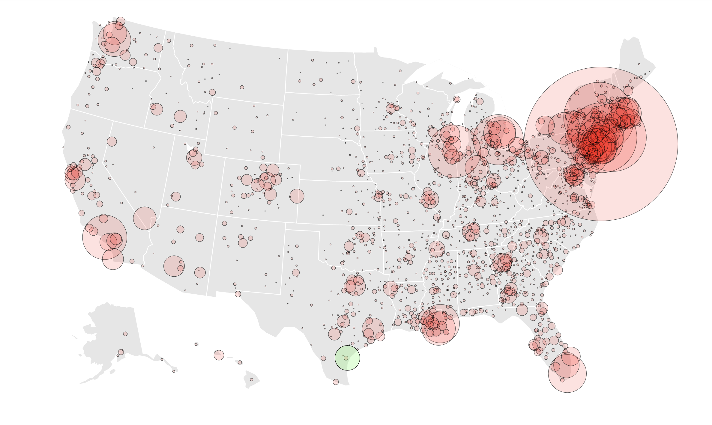

## Mapping the New York Times Data

A first attempt to pull and plot the Covid-19 data collected by the New York Times.
See [The Times github repository](https://github.com/nytimes/covid-19-data).

The plot is rendered using a [plotly](https://plotly.com/python/) style that is reverse-engineered to be similar to the style of the [maps published on the Times site](https://www.nytimes.com/interactive/2020/us/coronavirus-us-cases.html). An interface is added that allows a user to type in an address, and see the most recent Covid-19 statistics of the US county of that address. The idea is to allow people to see what's going on near family and friends, without having to know what county they live in. This uses a geocoding API from [HERE.com](https://www.here.com/). The result looks something like this:

Next up will be timelines and forecasts of the cases and deaths over the coming days, incorporating some basic statistical modelling. 

